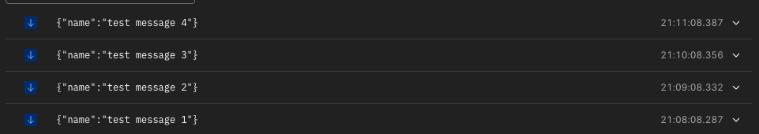

# Events SDK

A scalable pub/sub handling SDK built with Fastify that supports both in-memory (Native) and Redis implementations through HTTP and WebSocket protocols.

## Stack
- NodeJS v22
- Typescript
- Fastify
- Redis
- Docker
- nginx

## Features

- Multiple transport layers:
  - HTTP REST API (To post and list messages)
  - WebSocket real-time connections (To subscribe to specific topic)
- Storage implementations:
  - Native (in-memory) for single instance usage
  - Redis 
- Built with Fastify framework
- TypeScript support
- Environment-based configuration

### Starting the Server

```bash
docker-compose up
```

The server will start on port 80 by default.

## API Reference

### Native SDK (In-Memory)

#### HTTP Endpoints

```typescript
// List messages from topic
GET /api/native-sdk/topics/:topic

// Publish message to topic
POST /api/native-sdk/topics/:topic
Body: { name: string }
```

#### WebSocket Endpoints

```typescript
// Subscribe to topic
WS /ws/native-sdk/topics/subscribe?topic=your-topic
```

### Redis SDK (Distributed)

#### HTTP Endpoints

```typescript
// List messages from topic
GET /api/redis-sdk/topics/:topic

// Publish message to topic
POST /api/redis-sdk/topics/:topic
Body: { name: string }
```

#### WebSocket Endpoints

```typescript
// Subscribe to topic
WS /ws/redis-sdk/topics/subscribe?topic=your-topic
```

## Usage Examples

### HTTP Publishing

```typescript
// Publish to Native SDK
await fetch('http://localhost:80/api/native-sdk/topics/my-topic', {
  method: 'POST',
  headers: { 'Content-Type': 'application/json' },
  body: JSON.stringify({ name: 'Hello World' })
});

// Publish to Redis SDK
await fetch('http://localhost:80/api/redis-sdk/topics/my-topic', {
  method: 'POST',
  headers: { 'Content-Type': 'application/json' },
  body: JSON.stringify({ name: 'Hello World' })
});
```

### WebSocket Subscribing

```typescript
// Subscribe using Native SDK
const ws = new WebSocket('ws://localhost:80/ws/native-sdk/topics/subscribe?topic=my-topic');
ws.onmessage = (event) => {
  console.log('Received:', JSON.parse(event.data));
};

// Subscribe using Redis SDK
const ws = new WebSocket('ws://localhost:80/ws/redis-sdk/topics/subscribe?topic=my-topic');
ws.onmessage = (event) => {
  console.log('Received:', JSON.parse(event.data));
};
```

## Configuration

Environment variables:

```bash
# Optional: Time in seconds before message delivery timeout (default: 60)
SDK_TIME_TO_DELIVERY_IN_SECONDS=60

# Required for Redis SDK
REDIS_URL=redis://localhost:6379
```

## Docker Compose Configuration

The application is containerized using Docker Compose with the following services:

### App Service
- Built from local Dockerfile
- Runs 6 replicas for horizontal scaling
- Connects to Redis using environment variables
- Exposed on port 80 (internally)

### Redis Service
- Uses Redis Alpine image
- Persists data using a named volume
- Exposed on port 6379
- Provides distributed storage for the SDK

### Nginx Service
- Load balancer for the app instances
- Exposes the application on port 80
- Uses custom nginx configuration
- Distributes traffic across app replicas

To start all services:

```bash
docker-compose up
```

## Unit tests

Unit tests available by jest on the following script

```bash
npm run test:unit
```

## Proof of work


